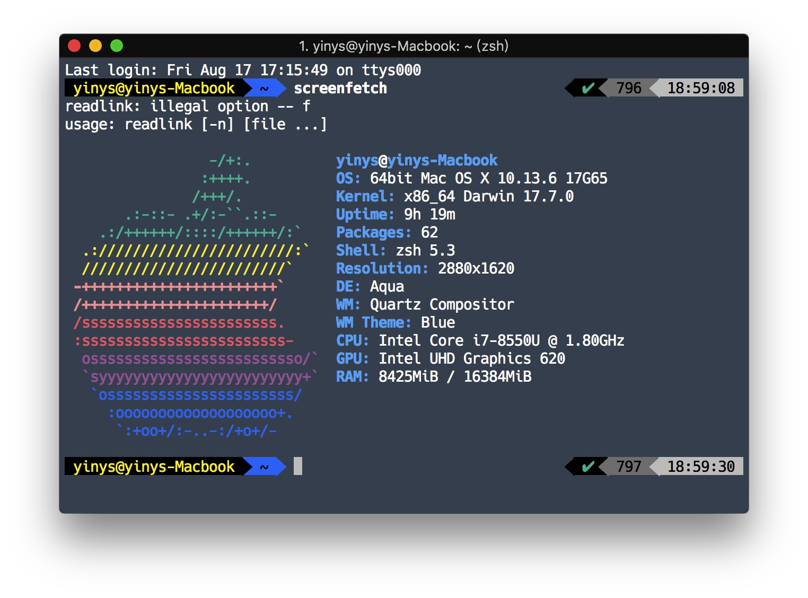
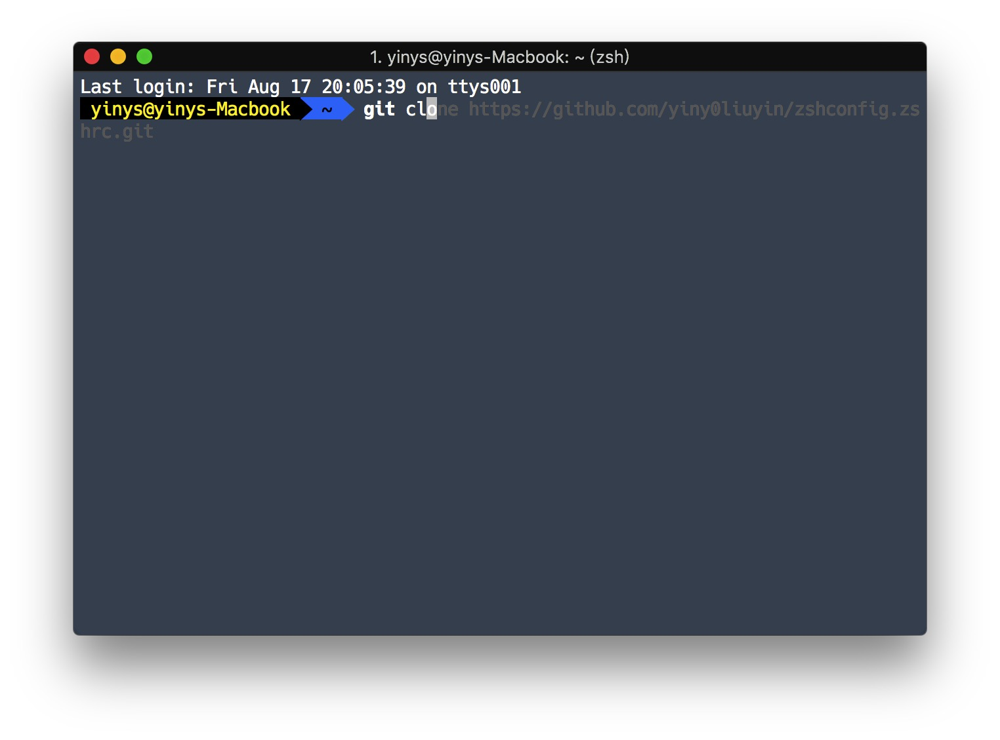

# 一键式配置zsh(自用)
在参考知乎基础上进行修改,配置自己的.zshrc
****
## 效果


## 实现的功能
自动跳转  
高亮  
安装皮肤powerline9k  
安装powerline字体  
命令提示  
自动补全  
....

# 依赖
请检查是否已经安装git,zsh,oh-my-zsh.  
大陆用户确保已经使用了代理  
* __请使用127.0.0.1:1086的socks端口 否则请自行修改 安装.zshrc 中的 ` export all_proxy=127.0.0.1:1086 ` 改成 其他 __ 
## 安装oh-my-zsh
请确保已安装curl    

```bash  
sh -c "$(curl -fsSL https://raw.githubusercontent.com/robbyrussell/oh-my-zsh/master/tools/install.sh)"
```

# 安装
```bash
git clone https://github.com/yiny0liuyin/zshconfig.zshrc.git && cd zshconfig.zshrc && mv 安装.zshrc ~/.zshrc && zsh
```
# 使用
安装完成后 请执行 

```bash
cd && cd zshconfig.zshrc && mv 使用.zshrc ~/.zshrc && rm ~/zshconfig.zshrc 
```

## 如果你觉得麻烦请执行(忽略以上两条代码)
```bash
git clone https://github.com/yiny0liuyin/zshconfig.zshrc.git && cd zshconfig.zshrc && mv 原始.zshrc ~/.zshrc && zsh
```

# 默认使用zsh
  
  ```bash  
  chsh -s /usr/bin/zsh
  ```

# mac安装包管理器 homebrew

 * 包管理器可以省去很多时间去编译安装 这也是必转之处.
 
 ## 安装
   
   ```bash
   /usr/bin/ruby -e "$(curl -fsSL https://raw.githubusercontent.com/Homebrew/install/master/install)"
   ```
   
   * 请挂代理 
 
